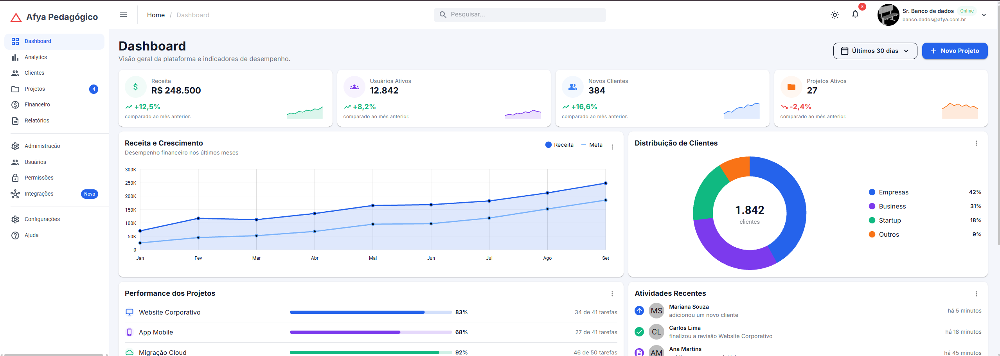
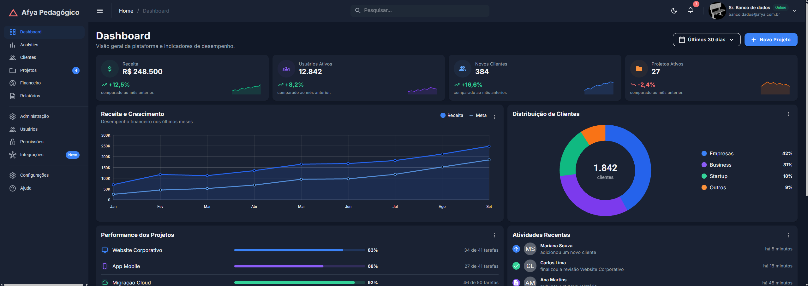
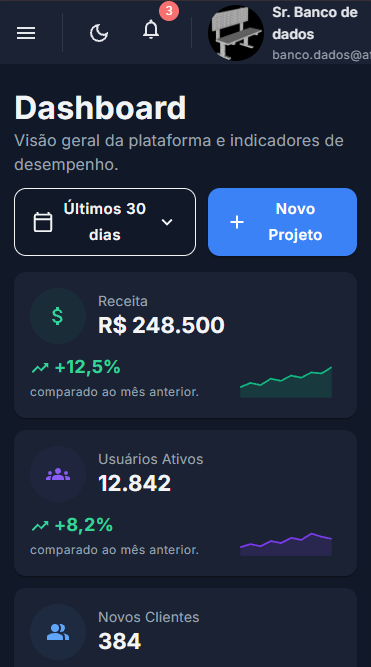
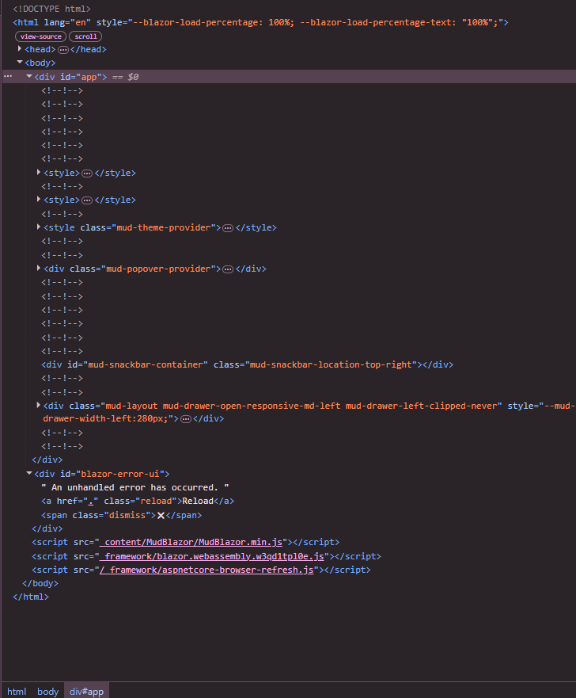

# Afya Admin — Dashboard com Blazor WebAssembly e MudBlazor

## Identificação

**Aluno(a)** : JOÃO VITOR FERREIRA RIBEIRO  
 **Matrícula** : 2627981  
 **Faculdade** : AFYA - SÃO LUCAS  
 **Curso** : CIÊNCIAS DA COMPUTAÇÃO  
 **Disciplina** : PROGRAMAÇÃO PARA SISTEMAS WEB
**Professor(a)** : LILUYOUD CURY DE LACERDA  
 **Semestre** : 2026.2

## Objetivo do projeto

O objetivo do projeto é na construção de um painel administrativo (Dashboard) para a "Afya Pedagógico", com foco no aprendizado de Blazor WebAssembly e MudBlazor. O objetivo foi entender como a tecnologia: como o Blazor gera o HTML a partir do código Razor, como os componentes recebem dados por parâmetros e como o layout se adapta a diferentes telas. A página reúne sidebar, AppBar, KPIs com mini gráficos, gráficos de linha e de rosca, performance dos projetos, atividades recentes e uma tabela. Tudo foi feito sem CSS próprio, usando apenas parâmetros, o tema (MudTheme) e as classes utilitárias do MudBlazor, com dados fictícios na pasta Data e sem backend. Assim, foram praticados a componentização, RenderFragment, @bind, o layout responsivo e a alternância entre tema claro e escuro.

## Tecnologias utilizadas

- .NET 10 / Blazor WebAssembly (standalone)
- MudBlazor 9
- C# e Razor
- Git e GitHub
- VS Code com C# Dev Kit

## Como executar

Pré-requisito: **.NET SDK 10** (confira com `dotnet --version`, que deve começar com `10.`).

```bash
git clone https://github.com/SEU-USUARIO/afya-admin.git
cd afya-admin
dotnet watch
```

O terminal mostra a URL (por exemplo, `http://localhost:5147`). A porta pode variar, então use a que aparecer no seu terminal.

## Telas

### Tema claro



### Tema escuro



### Versão mobile



### HTML gerado (DevTools)



Explique em poucas linhas o que o print do DevTools mostra: qual componente você inspecionou, qual HTML ele gerou e quais classes apareceram.

Ao inspecionar o HTML gerado, cada parâmetro dos componentes vira uma classe CSS. O `<MudPaper Elevation="1" Class="pa-4">` virou uma `<div class="mud-paper mud-elevation-1 pa-4">`, e o `Height="100%"` virou o atributo `style`. Os `<MudStack>` viraram `<div>` com classes de flexbox: `Row="true"` virou `flex-row`, `AlignItems.Center` virou `align-center` e `Spacing="3"` virou `gap-3`. O `<MudButton>` virou um `<button>` com `mud-button-filled`, `mud-button-filled-primary` e `mud-button-filled-size-large`, vindos de `Variant`, `Color` e `Size`. Já o `<MudAvatar>` do KPI recebeu a classe `mud-success-hover`, devolvida por `Ui.FundoSuave(Color.Success)`, que cria o fundo verde claro sem CSS próprio.

## Estrutura do projeto

```
afya-admin/
├── Components/
│   ├── AtividadesRecentes.razor
│   ├── CabecalhoPagina.razor
│   ├── DashboardCard.razor
│   ├── GraficoDistribuicaoClientes.razor
│   ├── GraficoReceita.razor
│   ├── KpiCard.razor
│   ├── PerformanceProjetos.razor
│   ├── ProjetosRecentes.razor
│   ├── SeletorPeriodo.razor
│   └── Ui.cs
├── Data/
│   └── DashboardData.cs
├── Layout/
│   ├── MainLayout.razor
│   └── NavMenu.razor
├── Pages/
│   ├── Dashboard.razor
│   └── NotFound.razor
├── Properties/launchSettings.json
├── docs/prints/
├── wwwroot/
│   ├── css/app.css
│   ├── img/alex-morgan.jpg
│   └── index.html
├── _Imports.razor
├── afya-admin.csproj
├── App.razor
└── Program.cs
```

- `Components/`: componentes reutilizáveis do dashboard (o "como mostrar") e o `Ui.cs`, com funções auxiliares de apresentação.
- `Data/`: modelos (records) e dados fictícios (o "o quê" mostrar).
- `Layout/`: a moldura da aplicação: `MainLayout` (AppBar, sidebar, tema) e `NavMenu` (links do menu).
- `Pages/`: páginas que respondem a uma rota. `Dashboard.razor` só monta os componentes; `NotFound.razor` é a página 404.
- `wwwroot/`: arquivos estáticos servidos ao navegador (`index.html`, imagens, CSS base do template).
- `docs/prints/`: prints usados neste README.

## Componentes criados

`DashboardCard` => Card base reutilizável com título, subtítulo, ações, menu "⋮" e conteúdo: `Titulo`, `Subtitulo`, `Acoes`, `Menu`, `ChildContent`
`CabecalhoPagina` => Título e subtítulo da página, com botões de ação à direita: `Titulo`, `Subtitulo`, `Acoes`  
`SeletorPeriodo` => Menu com aparência de botão para escolher o período: `Opcoes`, `Valor`, `ValorChanged`  
 `KpiCard` => Card de indicador com ícone, valor, variação e sparkline: `Kpi`  
 `GraficoReceita` => Gráfico de linha Receita x Meta: `Meses`, `Receita`, `Meta`  
 `GraficoDistribuicaoClientes` => Gráfico de rosca com total no centro e legenda com percentuais: `Total`, `Segmentos`  
 `PerformanceProjetos` => Lista de projetos com barras de progresso: `Projetos`  
 `AtividadesRecentes` => Feed de atividades recentes: `Atividades`  
 `ProjetosRecentes` => Tabela de projetos recentes: `Projetos`

## O que aprendi

**1. Como uma aplicação Blazor WebAssembly inicia no navegador? Qual é o papel do `index.html`, da `<div id="app">` e do `Program.cs`?**

O navegador abre o `wwwroot/index.html`, que é a **única página HTML real** da aplicação. Nele existe uma `<div id="app">` contendo uma animação de carregamento. Em seguida, o script `_framework/blazor.webassembly.js` baixa o runtime .NET (compilado para WebAssembly) e as DLLs do projeto. Com tudo carregado, o runtime executa o `Program.cs`, onde a linha `builder.RootComponents.Add<App>("#app")` manda renderizar o componente `App` dentro do elemento `#app`, substituindo a animação de carregamento. O `App.razor` contém o roteador, que lê a URL, escolhe a página cujo `@page` corresponde e a renderiza dentro do layout padrão (`MainLayout`).

**2. Qual é a diferença entre um Layout, uma Page e um Component neste projeto? Dê um exemplo de cada.**

**Layout** é a "moldura" que aparece em todas as páginas (AppBar, sidebar, tema, providers). Ele herda de `LayoutComponentBase` e usa `@Body` para indicar onde o conteúdo da página será inserido. O exemplo seria o `MainLayout.razor` (e o `NavMenu.razor` usado dentro dele). Já o **pages** é um componente que representa uma tela acessível por uma URL, identificado pela diretiva `@page`. Um exemplo seria o `Dashboard.razor` com `@page "/"`. Neste projeto, a página apenas "monta" os componentes menores. O **component** (como o nome diz) é uma peça reutilizável de interface,ou seja, uma pequena parte de um todo, que recebe dados por parâmetros (`[Parameter]`). Um exemplo de componente: `KpiCard.razor`, que recebe um `Kpi` e desenha o card com ícone, valor, variação e sparkline.

**3. O que é um `RenderFragment` e como o `DashboardCard` usa esse recurso para ser reutilizado por vários cards?**

`RenderFragment` é um tipo de parâmetro que recebe um pedaço de marcação (HTML e outros componentes) em vez de um valor simples, criando "buracos" (slots) que quem usa o componente preenche. O `DashboardCard` aproveita isso para definir a estrutura comum a cinco blocos do dashboard e deixar as partes variáveis como slots. O slot `Acoes` fica à direita do título e recebe, por exemplo, a legenda de um gráfico ou o botão "Ver todos". O `Menu` traz os itens do menu "⋮", que só aparece se for informado. O `ChildContent`, nome especial do que fica entre as tags do componente, guarda o conteúdo principal, como gráfico, lista ou tabela. Assim, `GraficoReceita`, `GraficoDistribuicaoClientes`, `PerformanceProjetos`, `AtividadesRecentes` e `ProjetosRecentes` reaproveitam a mesma moldura e só preenchem os slots, sem repetir a marcação cinco vezes.

**4. Como funciona o `@bind-Valor` no `SeletorPeriodo`? Qual é o papel do `ValorChanged`?**

O Blazor segue uma convenção: se um componente tem um parâmetro `Valor` e um `EventCallback<T>` chamado `ValorChanged`, quem o usa pode escrever `@bind-Valor="_periodo"`. O Blazor então: passa o valor da variável `_periodo` da página para dentro do componente (`Valor`), e depois quando o componente dispara `ValorChanged`, atualiza `_periodo` com o novo valor. O papel do `ValorChanged` é **avisar o pai** de que o usuário escolheu uma nova opção. No `SeletorPeriodo`, ao clicar num item do menu, é chamado `ValorChanged.InvokeAsync(opcao)`. O componente **não altera o próprio `Valor`**: ele só comunica a mudança. O **dono do estado é a página** (`Dashboard.razor`, com a variável `_periodo`), que atualiza o valor e o repassa de volta ao componente, fazendo o texto do botão mudar (essa eu tive que olhar no tutorial).

**5. Por que os dados ficam na pasta `Data`, separados dos componentes? Que vantagem isso traz se, no futuro, os dados vierem de uma API?**

É a separação entre **"o quê"** e **"como"** mostrar: `Data` responde o que exibir (números, nomes, cores de cada item, definidos nos `record`s e em `DashboardData`), enquanto `Components` responde como exibir (layout, gráficos, tipografia). Além de deixar o código mais organizado, evita um `Dashboard.razor` gigante (400+ linhas) e difícil de manter. A vantagem para o futuro: os componentes recebem tudo **por parâmetros**, sem saber de onde os dados vêm. Se os dados passarem a vir de uma API de verdade, basta trocar a origem dos dados (por exemplo, por um serviço que usa `HttpClient`), e os componentes continuam **exatamente iguais**.

**6. Como o `MudGrid` com `xs`, `sm` e `lg` faz os cards de KPI se reorganizarem em telas de tamanhos diferentes?**

O MudGrid divide a largura em 12 colunas, e cada MudItem informa quantas colunas ocupa em cada tamanho de tela. Nos KPIs, xs="12" sm="6" lg="3" faz o layout se adaptar: em celulares (menos de 600px) cada card ocupa as 12 colunas, ficando um por linha; em tablets (a partir de 600px) ocupa 6, formando dois por linha; e em desktops (a partir de 1280px) ocupa 3, cabendo quatro por linha. Cada valor vale para aquele tamanho de tela e para os maiores, até ser sobrescrito por um breakpoint maior, e o grid quebra a linha automaticamente quando a soma das colunas passa de 12. O Spacing="3" define o espaço entre os itens, de 12px (3 × 4px).

**7. Como foi possível estilizar a página inteira sem escrever CSS? Explique o papel do tema (`MudTheme`) e das classes utilitárias.**

1. **Parâmetros dos componentes**: controlam boa parte da aparência, como `Elevation="1"`, `Variant="Variant.Filled"`, `Color="Color.Primary"`, `Size="Size.Large"` e `Rounded="true"`.
2. **O tema (`MudTheme`)**: concentra, num só lugar, as paletas (clara e escura), a tipografia (fonte Inter, títulos em negrito, botões sem caixa alta) e as medidas do layout (`DefaultBorderRadius = "12px"`, `AppbarHeight = "72px"`). Os componentes leem as cores de variáveis CSS geradas a partir do tema (como `--mud-palette-primary`), então mudar o tema muda todos os componentes juntos. O modo escuro também vem "de graça": basta definir a `PaletteDark` e alternar `IsDarkMode`.
3. **Classes utilitárias nativas do MudBlazor**, já presentes no `MudBlazor.min.css`:
   - espaçamento: `pa-4`, `px-3`, `mt-2`, `mb-4`;
   - flexbox e exibição: `d-flex`, `flex-column`, `flex-grow-1`, `align-center`, `d-none d-md-flex` (oculto em telas pequenas);
   - aparência: `rounded-lg`, `mud-width-full`, `mud-background-gray`, `border-b border-solid mud-border-lines-default`;
   - cores: `mud-text-secondary` (texto cinza de apoio) e `mud-success-hover` (fundo suave da cor da paleta, usado atrás dos ícones dos KPIs via `Ui.FundoSuave`).

**8. Por que o namespace do projeto é `afya_admin` e não `afya-admin`?**

O .NET usa o nome do projeto como namespace raiz, mas o **hífen (`-`) não é permitido em identificadores C#**: `afya-admin` seria interpretado como a subtração "afya menos admin". Por isso o SDK troca os caracteres inválidos por **sublinhado**, resultando em `afya_admin`. O mesmo ocorre com nomes que começam com número (`06_Admin` vira `_06_Admin`). Por isso há duas grafias: **com hífen** (`afya-admin`) na pasta, no arquivo `.csproj` e no bundle `afya-admin.styles.css`; e **com sublinhado** (`afya_admin`) no código C# e Razor (`using afya_admin;`, `@using afya_admin.Layout`, `namespace afya_admin.Components`).

## Dificuldades e soluções

### 1. Linguagem + FrontEnd

Uma das minhas principais dificuldades foi com a linguagem (C#) e com o projeto ser FrontEnd, como não construo projetos focados nisso sentir dificuldade num primeiro momento. Já com a linguagem minha atual stack é node.js e Java o que muda algumas coisas de sintaxe e de tipagem, mas com 20 - 30 minutos de projeto eu conseguir desenrolar um pouco.

### 2. Resolver bugs

Há alguns bugs no projeto tanto na versão mobile quanto na hora de testar dos menus de notificação e perfil. Acho que pelp projeto ser mobile e eu não conhecer muito de mudblazor e de frontend em si, fiquei travado na solução chegue a procurar no tutorial e também na documentação oficial e também pedir ajuda ao claude para que revisasse uma parte do código para mim porque não estava entendo, mas no final copnseguir resolver o bug, tanto dos menus quanto no mobile.

## Melhorias futuras (opcional)

Acho que deixaria o site dinâmico (Deixar ele sem hardcode), é legal construir o layout com dados estátiscos porém ter dados reais que se alteram ao passar do tempo se tornar um desafio maior e te preparar mais ainda ao mercado de trabalho.

Não fiz os desafios adicionais.
